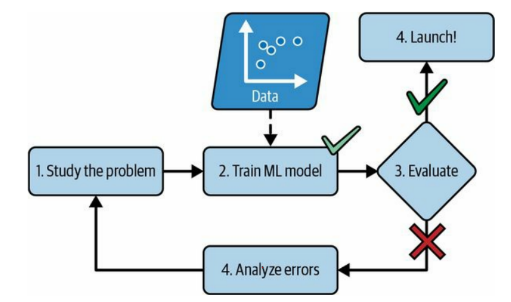

# Machine Learning Fundamentals

**Date: 23 June 2026**

---

## What is Machine Learning?

Machine Learning (ML) is a form of artificial intelligence that allows a system to learn from data rather than through explicit programming.

In the ML approach, the computer is given examples (data) and learns the rules by itself.

```text
Input + Output (examples) → Learning → Model (Rules)
New Input + Model → Prediction
```



### Summary

- Just storing data is not machine learning.
- ML is about improving performance with experience.
- The system learns patterns from data rather than following hardcoded rules.
- The model is what makes predictions.
- One of the earliest ML use-cases was spam detection.
- Unlike traditional programming, ML systems adapt as they see more data.

---

## Types of Machine Learning Systems

There are so many different types of Machine Learning systems that it is useful to classify them in broad categories, based on the following criteria:

- Whether or not they are trained with human supervision (Supervised, Unsupervised, Semisupervised, and Reinforcement Learning)
- Whether or not they can learn incrementally on the fly (Online versus Batch learning)
- Whether they work by simply comparing new data points to known data points, or instead by detecting patterns in the training data and building a predictive model, much like scientists do (Instance-based versus Model-based learning)

Machine Learning systems are mainly classified according to the amount and type of supervision they get during training.

There are three major categories:

### 1) Supervised Learning
In supervised learning, the training set you feed to the algorithm includes the desired solutions, called labels.

Examples:
- Email spam detection
- House price prediction
- Classification tasks where the target is known

### 2) Unsupervised Learning
In unsupervised learning, the training data is unlabeled. The system tries to learn without a teacher.

Examples:
- Customer segmentation
- Clustering
- Pattern discovery in unlabeled data

### 3) Reinforcement Learning
The learning system, called an agent in this context, can observe the environment, select and perform actions, and get rewards in return. It must then learn by itself what is the best strategy, called a policy, to get the most reward over time. A policy defines what action the agent should choose when it is in a given situation.

Examples:
- Self-driving cars
- Video games
- Robotics

### Cheat Sheet

| Learning Type | Learns From | Example Task |
| :------------- | :----------- | :------------ |
| Supervised | Labeled data | Email spam filter |
| Unsupervised | Unlabeled data | Customer segmentation |
| Reinforcement | Trial and error | Self-driving car, video games |

---

## Batch Learning vs Online Learning

### Batch Learning
Batch learning uses the complete dataset to train the model in one go.

Key idea:
- Train once on a fixed dataset.
- Retrain when new data becomes available.
- Works well when data distribution is relatively stable.

### Online Learning
Online learning updates the model incrementally as new data arrives.

Key idea:
- Learns on the fly.
- Useful for streaming or frequently changing data.
- Can adapt to new patterns without full retraining.

---

## Instance-Based vs Model-Based Learning

### Instance-Based Learning
Instance-based learning makes predictions by comparing a new data point to known examples.

Characteristics:
- Stores training examples.
- Prediction is based on similarity search.
- Often simple but can be slow at inference time.

Example:
- K-Nearest Neighbors (KNN)

### Model-Based Learning
Model-based learning detects patterns in the training data and builds a predictive model.

Characteristics:
- Learns an explicit function or structure.
- Prediction uses learned parameters.
- Often better for scaling and generalization.

Examples:
- Linear Regression
- Logistic Regression
- Neural Networks

---

## Machine Learning Algorithms and Their Types

Selecting the right algorithm is both science and art. Two data scientists tasked with solving the same business challenge can choose different algorithms to address the same problem. However, understanding different classes of machine learning algorithms helps data scientists identify the best types of algorithms. The algorithms below give a brief overview of the main types of machine learning algorithms.

### Bayesian
Bayesian algorithms allow data scientists to encode past beliefs about what models should look like, regardless of the state of the data. With so much focus on the data defining the model, you might wonder why people would be interested in Bayesian algorithms. These algorithms are especially useful when you don’t have huge amounts of data to train a model with confidence.

Useful when:
- Prior knowledge matters
- Data is limited
- Uncertainty estimation is important

### Clustering
Clustering is a fairly simple technique to understand — objects with similar parameters are grouped. All objects in a cluster are more similar to each other than objects in other clusters. Clustering is a type of unsupervised learning because the data is not labelled. The algorithm interprets the parameters that make up each element, then groups them accordingly.

Useful when:
- You want to group similar items
- Labels are not available
- You want to discover hidden structure

### Decision Tree
Decision tree algorithms use a branching structure to illustrate the results of a decision. Decision trees can be used to map the possible outcomes of a decision. Each node in a decision tree represents a possible outcome. Percentages are assigned to nodes based on the likelihood of the outcome occurring.

Useful when:
- Interpretability is important
- Decision logic needs to be visualized
- You want a simple rule-based model

### Regression Algorithms
Regression algorithms can quantify the strength of the correlation between variables in a data set. In addition, regression analysis can be useful in predicting future values of data based on historical values. However, it is important to remember that regression analysis assumes that the correlation is related to causation. If you don’t understand the context around the data, regression analysis can lead you to inaccurate predictions.

Useful when:
- Target is continuous
- Trend estimation is needed
- Forecasting is required

Examples:
- Linear Regression
- Polynomial Regression
- Ridge Regression
- Lasso Regression

### Neural Networks
A neural network is inspired by the way a human brain approaches problems and uses layers of interconnected units to learn and infer relationships based on observed data. Models of neural networks can adapt and learn as data changes. Neural networks are often used when data is unlabeled or unstructured. One of the main use cases of neural networks is computer vision.

Useful when:
- Relationships are complex and nonlinear
- Data is high-dimensional
- You need representation learning

Applications:
- Computer vision
- Speech recognition
- Natural language processing
- Pattern recognition

---

## Key Takeaways

- Machine learning is about learning from data, not hardcoding rules.
- Supervised learning uses labeled data.
- Unsupervised learning uses unlabeled data.
- Reinforcement learning learns by interacting with an environment.
- Batch learning retrains on full data; online learning adapts incrementally.
- Instance-based learning compares to stored examples; model-based learning builds a predictive model.
- Bayesian methods, clustering, decision trees, regression, and neural networks represent major algorithm families.

---

## Interview Answer (1 Minute)

> Machine learning is a branch of artificial intelligence that enables systems to learn patterns from data instead of relying on explicit programming. Based on the type of supervision, ML can be supervised, unsupervised, or reinforcement learning. It can also be batch or online learning, and instance-based or model-based learning. Common algorithm families include Bayesian methods, clustering, decision trees, regression algorithms, and neural networks. The goal is to build models that generalize well and make accurate predictions on new data.
