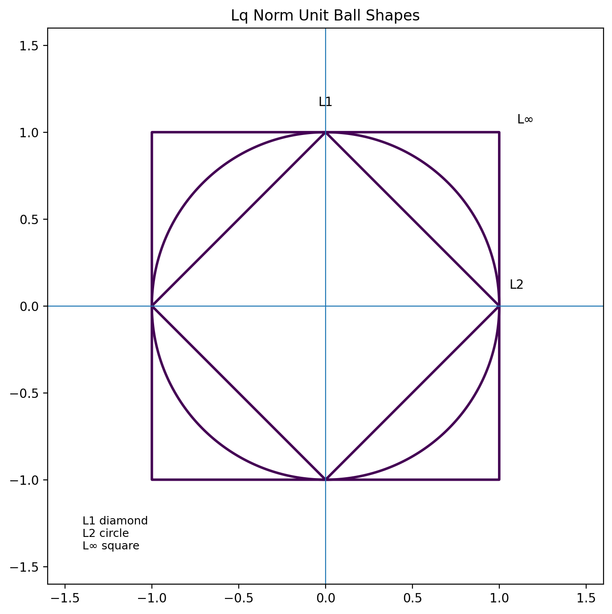
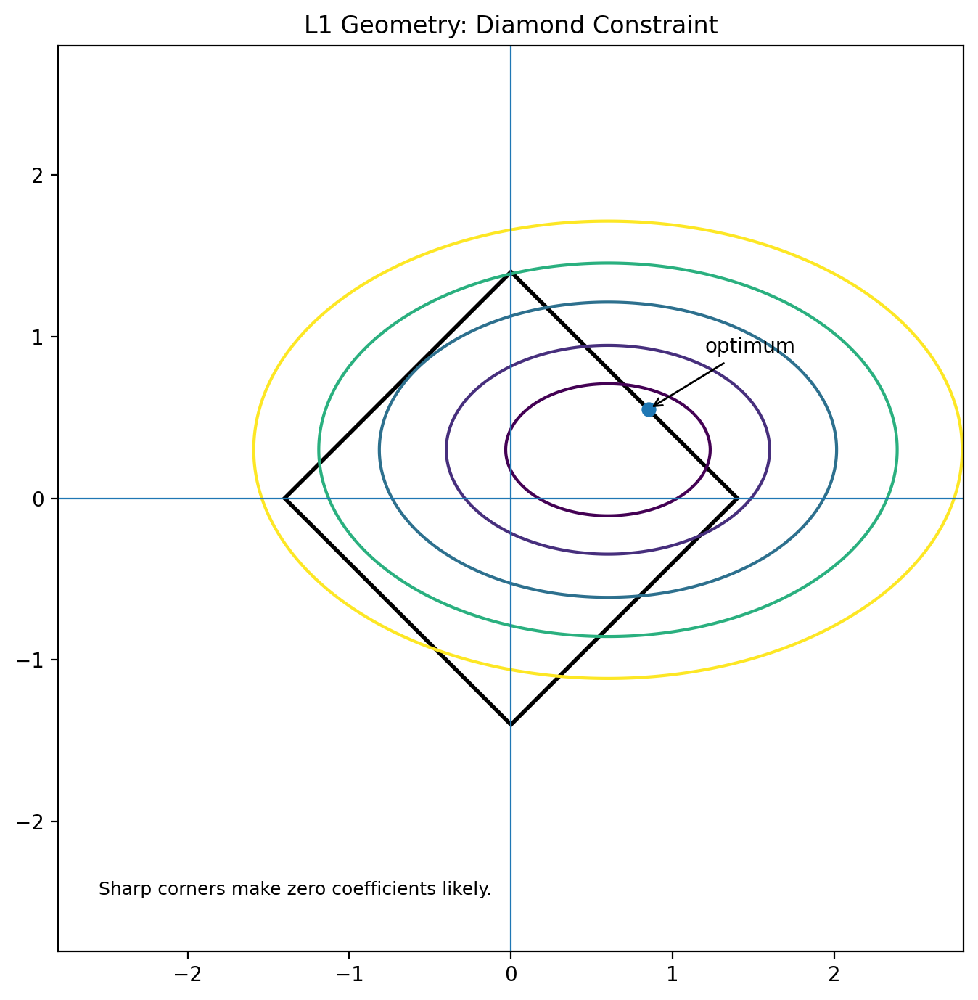
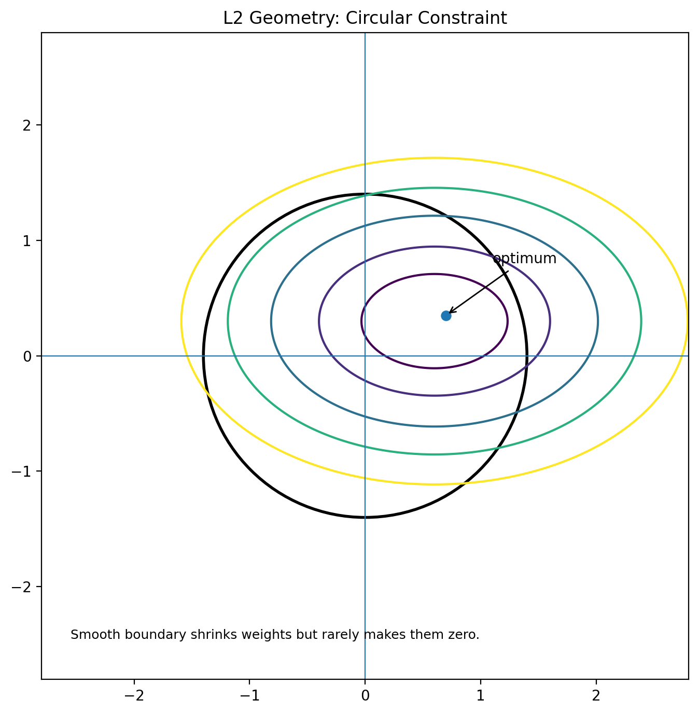
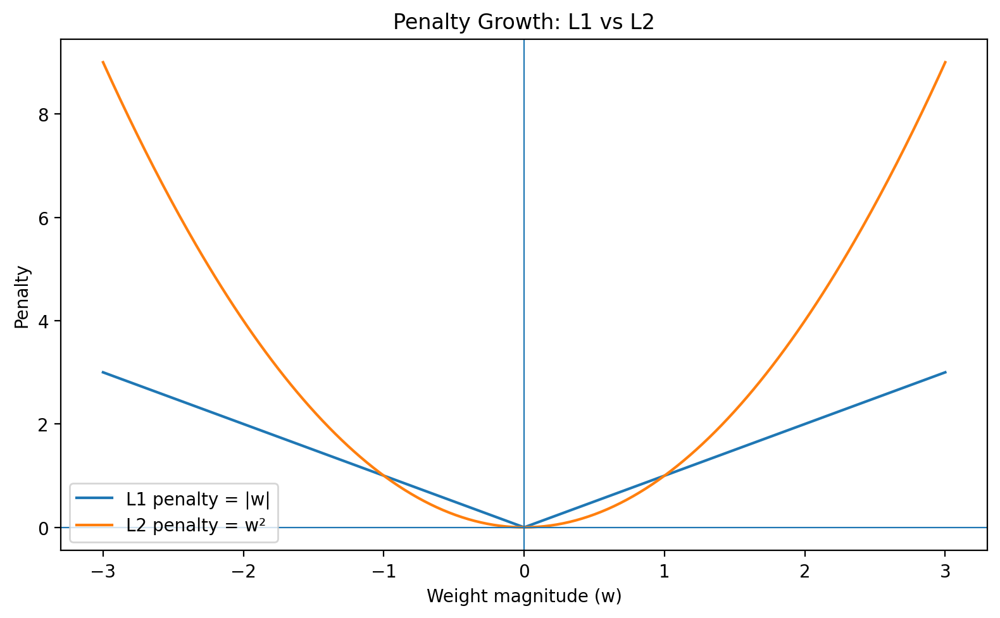
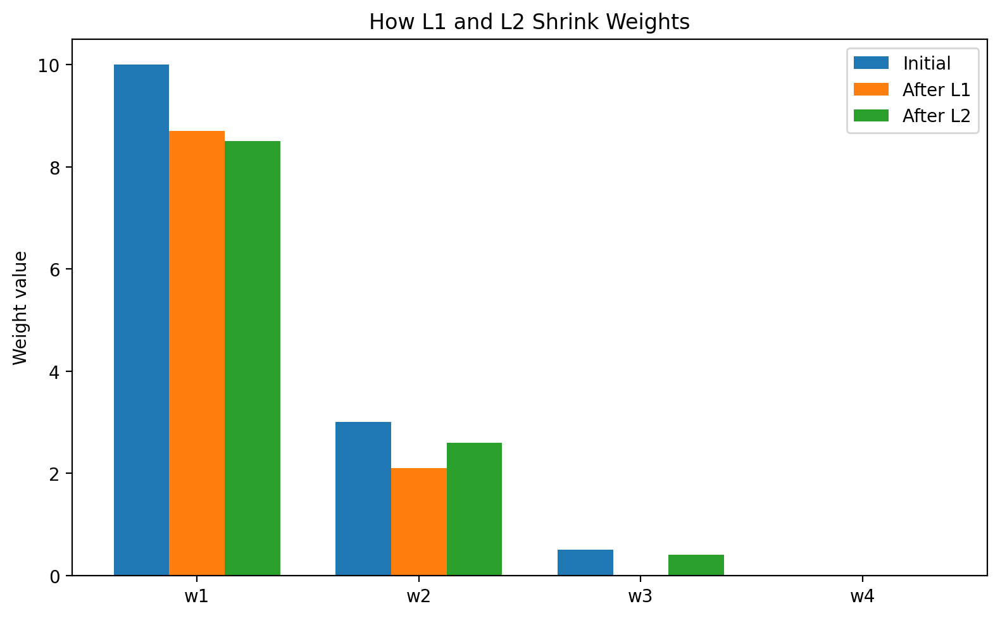

# Day 004 - Regularization: Lq, L1 vs L2

**Date: 19 June 2026**

---

# Why Do We Need Regularization?

One of the biggest challenges in machine learning is **overfitting**.

Overfitting happens when a model learns not only the underlying pattern in the training data but also the noise and random fluctuations. The model performs very well on training data but poorly on unseen data.

Regularization is a technique used to reduce overfitting by penalizing large weights and pushing the model toward simpler solutions that generalize better.

---

# Intuition Behind Regularization

Suppose we have a linear model:

```text
y = w₀ + w₁x₁ + w₂x₂ + ... + wₙxₙ
```

Without regularization, the model may assign very large values to some weights to fit the training data extremely well.

Regularization adds a penalty term to the cost function so that excessively large weights become expensive.

That forces the model to learn a smoother and simpler function.

---

# Lq Norm

Regularization is based on vector norms.

For a weight vector:

```text
w = [w₁, w₂, w₃, ..., wₙ]
```

The general Lq norm is:

```text
||w||q = (|w₁|ᵠ + |w₂|ᵠ + ... + |wₙ|ᵠ)^(1/q)
```

where:

- q determines the type of norm.
- Different values of q produce different regularization behavior.

Examples:

- q = 1 → L1 norm
- q = 2 → L2 norm
- q = ∞ → max absolute coefficient



### Why This Matters

- **L1** uses the sum of absolute values.
- **L2** uses the square root of summed squares.
- **L∞** uses the largest absolute coefficient.

---

# L1 Regularization

L1 regularization uses the L1 norm.

## Cost Function

```text
J(w) = MSE + λ||w||₁
```

or equivalently:

```text
J(w) = MSE + λ Σ|wᵢ|
```

where:

- **MSE** = Mean Squared Error
- **λ** = regularization strength
- **|wᵢ|** = absolute value of each weight

---

## Why Does L1 Produce Sparse Models?

L1 adds a constant shrinkage force to each weight.

The derivative of the absolute value is:

```text
d|w|/dw = sign(w)
```

which means:

- +1 for positive weights
- -1 for negative weights

This shrinkage is constant, so even small weights get pushed toward zero. Eventually, some coefficients become exactly zero.

That is why L1 performs **automatic feature selection**.

Example:

```text
w = [5, 0.4, 0.03, 7, 0.001]
```

After L1 regularization, some weights may become:

```text
w = [4.8, 0, 0, 6.7, 0]
```

---

## Geometry Behind L1

L1 regularization creates a **diamond-shaped constraint region**.

The constraint looks like:

```text
|w₁| + |w₂| ≤ c
```

The loss contours are elliptical. Because the diamond has sharp corners, the optimum often lies on an axis or corner, which makes one or more coefficients exactly zero.



### Key Idea

Sharp corners make zero coefficients likely.

---

## Advantages of L1 Regularization

- Produces sparse models.
- Performs feature selection automatically.
- Useful when many features are irrelevant.
- Reduces model complexity.

## Disadvantages of L1 Regularization

- Can be unstable when features are highly correlated.
- Optimization is slightly more difficult than L2.

---

# L2 Regularization

L2 regularization uses the squared L2 norm.

## Cost Function

```text
J(w) = MSE + λ||w||₂²
```

or equivalently:

```text
J(w) = MSE + λ Σwᵢ²
```

This squared form is the one commonly used in practice because it is easier to differentiate.

---

## Why Does L2 Shrink Weights?

L2 penalizes large weights much more strongly than small ones.

Example:

```text
w = [5, 0.4, 0.03, 7]
```

Penalty contribution:

```text
25 + 0.16 + 0.0009 + 49 ≈ 74.1609
```

Large weights contribute disproportionately, so the model is pushed to reduce them.

---

## Gradient of L2

Since:

```text
Penalty = λ Σwᵢ²
```

the derivative is:

```text
d(w²)/dw = 2w
```

So the update becomes:

```text
w = w − α(∂J/∂w + 2λw)
```

This means:

- Large weights shrink faster.
- Small weights shrink more gently.
- Weights usually get smaller, but not exactly zero.

Example:

```text
Initial: [5, 0.4, 0.03, 7]
After L2: [4.6, 0.35, 0.025, 6.2]
```

---

## Geometry Behind L2

L2 regularization creates a **circular constraint region**.

The constraint looks like:

```text
w₁² + w₂² ≤ c
```

The loss contours are elliptical. Because the boundary is smooth, the optimum generally occurs away from the axes. That is why coefficients shrink smoothly but usually do not become exactly zero.



### Key Idea

Smooth boundaries shrink weights but rarely make them zero.

---

# L1 vs L2 Penalty

The penalty growth is different:

- L1 grows linearly with the magnitude of the weight.
- L2 grows quadratically with the magnitude of the weight.

That means L2 punishes large weights much more aggressively.



### Practical Consequence

- L1 is better when you want sparsity.
- L2 is better when you want smooth shrinkage and stability.

---

# Comparison: L1 vs L2

| Feature | L1 (Lasso) | L2 (Ridge) |
|-----------|------------|------------|
| Penalty | Σ|w| | Σw² |
| Feature Selection | Yes | No |
| Produces Sparse Model | Yes | No |
| Coefficients Become Zero | Often | Rarely |
| Handles Correlated Features | Moderate | Better |
| Optimization | Harder | Easier |
| Stability | Lower | Higher |

---

# How L1 and L2 Shrink Weights



Example:

```text
Initial weights: [10, 3, 0.5, 0.01]
After L1:        [8.7, 2.1, 0, 0]
After L2:        [8.5, 2.6, 0.4, 0.008]
```

L1 removes features. L2 keeps them but reduces their impact.

---

# Effect of λ (Lambda)

Lambda controls the strength of regularization.

## λ = 0

No regularization. High risk of overfitting.

## Small λ

Weak regularization. Weights shrink slightly.

## Large λ

Strong regularization. Weights become small. Too large a value can cause underfitting.

---

# Elastic Net Regularization

Elastic Net combines both L1 and L2 regularization.

## Cost Function

```text
J(w) = MSE + λ₁ Σ|w| + λ₂ Σw²
```

Advantages:

- Performs feature selection.
- Handles correlated features better than pure L1.
- Often used when datasets have many features.

---

# Why Deep Learning Often Uses L2

Neural networks usually contain many parameters. Removing parameters entirely is often undesirable. Instead, we want:

- Smaller weights
- Smoother decision boundaries
- Better generalization

L2 regularization gives these properties. In deep learning, weight decay is essentially L2 regularization, and modern optimizers like AdamW use this idea directly.

---

# When Should You Use Which?

## Use L1 When

- The dataset contains many irrelevant features.
- Feature selection is important.
- Sparse models are desired.

Examples:

- Text classification
- High-dimensional sparse problems

## Use L2 When

- Most features are useful.
- Features are correlated.
- Better stability is needed.

Examples:

- Regression models
- Neural networks
- General-purpose predictive models

---

# Key Takeaways

- Regularization prevents overfitting by penalizing large weights.
- Lq norms define the mathematical framework behind regularization.
- L1 uses absolute values and tends to produce sparse models.
- L2 uses squared weights and tends to shrink weights smoothly.
- L1 is useful for feature selection.
- L2 is useful for stability and smooth generalization.
- Elastic Net combines L1 and L2.

---

# Interview Answer (1 Minute)

> Regularization is a technique used to prevent overfitting by adding a penalty term to the loss function. In the general Lq framework, the norm controls how weights are penalized. L1 regularization, also called Lasso, adds the absolute values of weights and can drive some coefficients exactly to zero, which makes it useful for feature selection. L2 regularization, also called Ridge, adds the squared weights and shrinks coefficients smoothly without eliminating them. Geometrically, L1 creates a diamond-shaped constraint that favors corner solutions, while L2 creates a circular constraint that leads to smooth shrinkage. In practice, L1 is chosen for sparsity and L2 is chosen for stability and better generalization.
